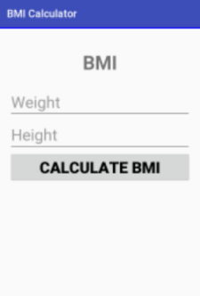

# Building a BMI Calculator

## Introduction
In this lab, you will create two activities for a BMI calculator. The first activity accepts the weight and 
height of the user and the second activity displays the BMI value.

## Instructions:
Create the following layouts for both activities. Make sure the layout works in both orientations with no 
problems. Use an intent to send the BMI value from the first activity to the second activity.

