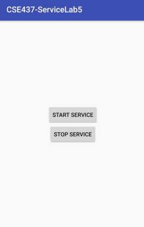

# Creating a Simple Service

## Introduction
A Service is an application component that can perform long-running operations in the background and does not provide a user interface. For example, an activity application component can start a service and it will continue to run in the background even if the user switches to another application. In this lab, you will develop a simple application that uses a service to play an mp3 file. Finally, you will be asked to use toasts to monitor the service life cycle and notify the user when the service is created, started, and destroyed. 

## Instructions: 
1. Create a new project with a blank activity
2. Add two buttons Start Service and Stop Service
3. Use onClick attribute in the layout XML or onClickListener Interface definition in the main activity Java file to callback two methods
    • startNewService -> to be invoked when the view “Start Service” is clicked.
        o Use startService (Intent service) to start a service
    • stoptNewService -> to be invoked when the view “Stop Service” is clicked
        o Use stopService (Intent service) to stop a service
4. Use the service to start and stop playing an mp3 file. Save the mp3 file in a raw folder (Right click on /res and create a new raw resource folder “name: raw” )- make sure the file name is all small letters

