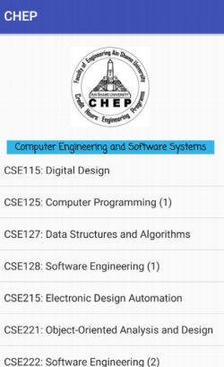

# Handling Files

## Introduction
Android uses a file system that's similar to disk-based file systems on other platforms. A File object works well for reading or writing large amounts of data in start-to-finish order without skipping around.
The exact location of the where your files can be saved might vary across devices, so you should use the methods and recommendations described on the Android Developer’s page https://developer.android.com/training/data-storage/files.html to access internal and external storage paths instead of using absolute file paths.

## Instructions:
Develop an application for the CHEP program that allows users to  check the current programs in the CHEP and display the list of courses in each program.
The list of the programs and courses should be stored in a text file and  saved in your project workspace. The application should read this file upon start and then use the contents to display the required lists upon request.
Use the following link to create the contents of this file:
https://eng.asu.edu.eg/CurrentPrograms

#### The application consists of 3 activities.
1. The first activity displays the logo of the CHEP and the list of programs (as a listview).
2. When a user selects a program, the second activity appears and displays the CHEP logo, title of the program (highlighted) and the list of courses in that program – as shown in the given screenshot.
3. The third activity should appear when the user clicks on the CHEP logo in any one of the first two activities. The contents of the third activity should be a short overview.

