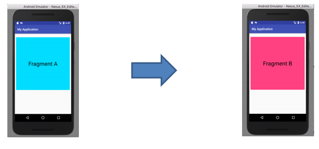

# Fragments and Broadcast Receivers

## Part 1: Fragments
### Introduction
A Fragment represents a behavior or a portion of user interface in a FragmentActivity. You can combine multiple fragments in a single activity to build a multi-pane UI and reuse a fragment in multiple activities. You can think of a fragment as a modular section of an activity, which has its own lifecycle, receives its own input events, and which you can add or remove while the activity is running (sort of like a "sub activity" that you can reuse in different activities).

## Part 2: Broadcast Receivers
### Introduction
Android apps can send or receive broadcast messages from the Android system and other Android apps, similar to the publish-subscribe design pattern. These broadcasts are sent when an event of interest occurs. For example, the Android system sends broadcasts when various system events occur, such as when the system boots up or the device starts charging. Apps can also send custom broadcasts, for example, to notify other apps of something that they might be interested in.

## Instructions:
In this lab assignment, you’ll use ACTION_TIME_TICK (ACTION_TIME_TICK is a broadcast action that indicates that the current time has changed). This action is sent every minute by the system. Please be aware that you cannot receive this action through components declared in manifests, only by explicitly registering for it with Context.registerReceiver(). The constant value that should be use is: "android.intent.action.TIME_TICK"

#### Develop an application that changes the layout of its main screen every minute as follows:
1. The application has one activity and two fragments – fragment A and fragment B
2. You are free to choose any layout design for the activity and fragments
3. The layout of the main activity starts with Fragment A layout on the foreground
4. Every minute, the main activity replaces the current fragment with the second fragment through a fragment transaction. (the app should alternate between the fragments upon receiving the broadcast message)
5. The application uses a broadcast receiver to listen to ACTION_TIME_TICK

